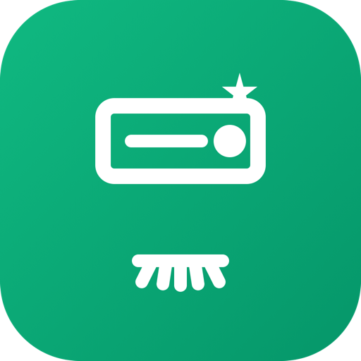

    

# Dev Cache Cleaner

Scan and clean developer caches, build artifacts, and orphaned dependencies to reclaim disk space. No external tools required — works out of the box.

## Is It Safe?

**Yes.** Dev Cache Cleaner is designed with safety as a priority:

- **It never touches your code, documents, or personal files** — only caches and build artifacts that developer tools regenerate automatically
- Every item is classified as **Safe** (green) or **Review** (orange) — you always know what you're cleaning
- **Clean Safe Caches** only removes items marked as Safe — things like npm/Yarn/Homebrew download caches that re-download automatically on next install
- **Scan Caches** lets you inspect everything before deciding what to clean — nothing is deleted without your action
- Build artifacts (like `node_modules`) are only flagged if older than 30 days (configurable), so active projects are never touched
- Items marked as "Review" (Xcode Archives, Docker volumes, app caches) always require explicit confirmation before deletion

**What "Safe" means in practice:** the worst that happens is a slightly slower first `npm install` or `brew install` next time — the tool simply re-downloads the cached files. No data is lost, no configuration changes, no system modifications.

## Commands

- **Scan Caches** — Full scan with dashboard showing reclaimable space by category, inspect details, and clean selectively
- **Clean Safe Caches** — Scan and instantly clean all safe caches with one click (with confirmation dialog showing what will be cleaned)
- **Cache Status** — Menu bar showing total reclaimable space, refreshes daily

## What It Scans

### Package Manager Caches
Download caches that package managers re-create automatically on next install:
- npm (`~/.npm`)
- Yarn (`~/Library/Caches/Yarn`)
- pnpm (`~/Library/pnpm/store`)
- Homebrew (`~/Library/Caches/Homebrew`)
- CocoaPods (`~/Library/Caches/CocoaPods`)
- pip (`~/Library/Caches/pip`)
- Composer (`~/Library/Caches/composer`)

### Build Artifacts & Dependencies
Scans your project directories for orphaned build artifacts **older than 30 days** (configurable):
- `node_modules`, `.next`, `.nuxt`, `.turbo`, `.parcel-cache`, `.angular`, `.svelte-kit`, `.expo`
- `dist`, `build`, `target` (Rust/Maven), `vendor` (PHP), `Pods` (CocoaPods)
- `venv`, `.venv`, `__pycache__` (Python)
- `DerivedData`, `.build` (Xcode/Swift), `coverage`, `.dart_tool`, `.gradle`

Rebuilding is as simple as running `npm install`, `cargo build`, or your usual build command.

### Xcode & iOS
- DerivedData — build indexes, rebuilt automatically by Xcode
- Archives — signed builds (marked as Review, requires confirmation)
- iOS Device Support — debug symbols, re-downloaded when device is connected
- iOS Simulators — unused runtimes (marked as Review, requires confirmation)

### Containers
- Docker images, containers, volumes, and build cache (if Docker is installed)
- Volumes are marked as Review since they may contain database data

### Language Caches
Cached dependencies that re-download on next build:
- Gradle (`~/.gradle/caches`)
- Maven (`~/.m2/repository`)
- Cargo/Rust (`~/.cargo/registry`)
- Go modules (`~/go/pkg/mod`)
- Ruby gems (`~/.gem`)

### System Caches & Logs
- User log files (`~/Library/Logs`) — apps recreate these automatically
- Top application caches in `~/Library/Caches` — marked as Review, skips Apple system caches

## What It Never Touches

- Source code and git repositories
- Documents, photos, downloads, or any personal files
- System files (`/System`, `/Library`)
- Configuration files, `.env` files, secrets, or credentials
- Active project dependencies (only flags artifacts older than the configured minimum age)

## Features

- Detail panel with path, size, clean command, and safety notes for each item
- Risk indicators: green = safe to clean, orange = review before cleaning
- Filter by risk level (Safe / All / Large > 1GB) or category
- Confirmation dialog before any destructive action
- Copy clean command to clipboard for manual execution
- Open path in Finder to inspect before cleaning
- Configurable project scan directories and minimum artifact age
- Menu bar badge with total reclaimable space

## Preferences

- **Project Directories** — Comma-separated list of directories to scan for build artifacts (default: auto-detects ~/Projects, ~/GitHub, ~/Code, etc.)
- **Minimum Age (days)** — Only flag build artifacts older than this many days (default: 30)

## Author

Developed by [Undolog](https://www.raycast.com/Undolog).

## License

Distributed under the MIT License.
