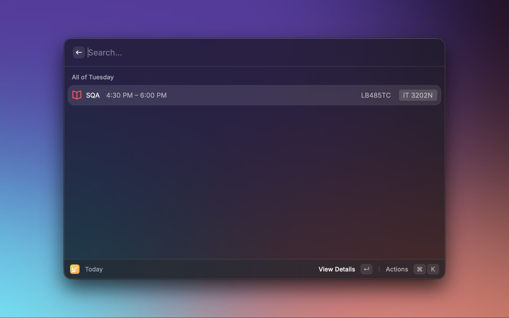
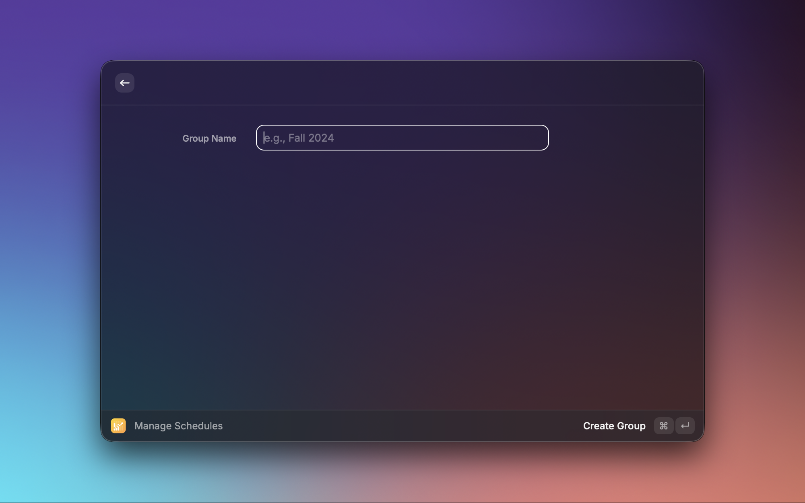
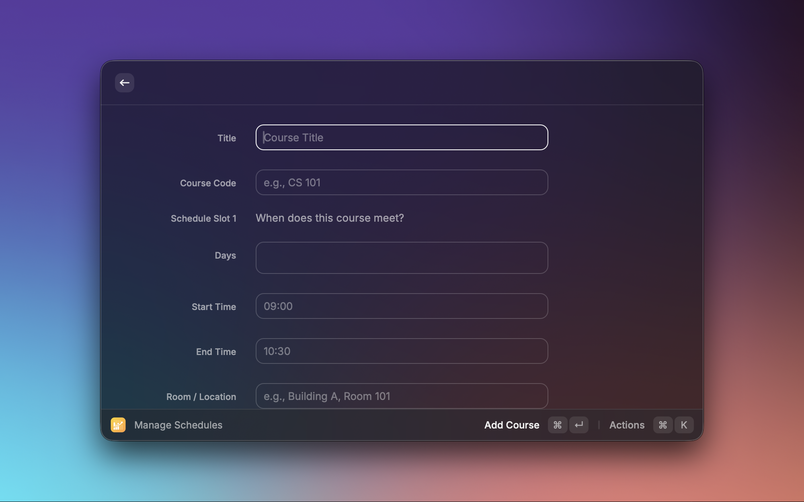

# Next Up

> A simple all-in-one class schedule manager for Raycast. See what's coming up next, browse your full week, and join meetings — all without leaving your keyboard.

---

## Features

- **Today** — Opens today's schedule with your next class highlighted. See all of today's courses at once, tap to view details, and open meeting links with a single keypress.
- **Schedule for the Week** — Browse your full weekly schedule with a day-picker dropdown. Today's day is marked with a star ★.
- **Manage Schedules** — Full CRUD for schedule groups and courses. Create multiple groups (e.g., "Semester 1", "Semester 2"), switch between them, and organize courses with colors, icons, rooms, and meeting links.
- **Next Up Menu Bar** — A persistent menu bar item that shows your next class title and start time. Click to see today's full schedule without opening Raycast, or jump straight to your meeting link.
- **Add Ephemeral Course** — Quickly add a one-day temporary course (e.g., a study group or special lecture). It auto-expires and disappears the next day — no cleanup needed.

---

## Commands

| Command                   | Description                                             |
| ------------------------- | ------------------------------------------------------- |
| **Today**                 | See your next upcoming class and all of today's courses |
| **Schedule for the Week** | Browse your full week by day                            |
| **Manage Schedules**      | Create, edit, and organize courses and schedule groups  |
| **Next Up Menu Bar**      | Persistent menu bar item with your next class           |
| **Add Ephemeral Course**  | Add a temporary one-day course                          |

---

## Getting Started

### 1. Create a Schedule Group

Open **Manage Schedules** → press `↵` (Enter) → select **Create New Group** → type a name (e.g., "AY 2025–2026 Sem 2") → press `↵`.

Your first group is automatically set as the **active group** — this is the group used by all other commands.

### 2. Add Courses

Inside your group, select **Group Settings** → **Add Course**.

Fill in:

- **Title** (required) — e.g., `Introduction to Computer Science`
- **Course Code** — e.g., `CS 101`
- **Schedule Slot** — pick days (Mon/Tue/Wed...), start time, end time, and room
- **Color** and **Icon** — for visual identification
- **Professor** and **Links** — optional quick-access fields

Press `⌘↵` to save.

### 3. Add Multiple Time Slots

One course can have multiple meeting patterns — for example, a MWF lecture and a Tuesday lab session. In the course form, press `⌘N` to add a second slot. Press `⌘⇧N` to remove the last slot.

### 4. Enable the Menu Bar

Open Raycast **Preferences → Extensions → Next Up** and enable **Next Up Menu Bar**. The item will appear in your macOS menu bar and update automatically.

### 5. Switch Between Semester Groups

Open **Manage Schedules**. Use the group picker in the top-right corner of the search bar to switch between groups. The selected group becomes active for all commands.

---

## Course Details

Each course supports the following fields:

| Field          | Description                                                               |
| -------------- | ------------------------------------------------------------------------- |
| Title          | Course name (required)                                                    |
| Course Code    | Short identifier shown as a tag (e.g., `CS 101`)                          |
| Schedule Slots | Days, start time, end time, room, meeting link (up to 3 slots per course) |
| Color          | Color tint for the course icon (9 named colors + custom hex)              |
| Icon           | Raycast icon for quick visual identification (27 options)                 |
| Units          | Academic credit units                                                     |
| Class Link     | Primary course URL (LMS, class page, etc.)                                |
| Extra Link     | Secondary URL (e.g., shared notes, resource page)                         |
| Professor      | Name and email — tap "Email Professor" to open Mail                       |
| Ephemeral      | One-day temporary course that auto-expires                                |

---

## Ephemeral Courses

An **ephemeral course** is a temporary entry that automatically disappears the next day. Use it for:

- One-off study sessions
- Guest lectures
- Rescheduled classes
- Any event that doesn't belong in your permanent schedule

Use the **Add Ephemeral Course** command for the fastest flow — just enter the title, time, and room. The course is added to your active group and removed automatically at midnight the next day.

You can also mark any course as ephemeral in the full course form inside **Manage Schedules**.

---

## Schedule Templates

Save a set of schedule slots as a **template** to quickly reuse common meeting patterns across courses. When adding or editing a course, open the action panel to apply a saved template — it pre-fills all slot days, times, and rooms in one step.

---

## Conflict Detection

Next Up automatically checks for time conflicts when you save a course. If the new slot overlaps with an existing course in the same group on the same day, the save is blocked and a toast shows which course conflicts and on which day. Edit the times to resolve before saving.

---

## Import & Export

Back up or transfer your schedule data using the **Export to File** and **Import from File** actions in **Manage Schedules**.

- **Export** saves a JSON snapshot to the folder configured in Extension Preferences (default: `~/Downloads`).
- **Import** reads a previously exported file and merges groups that don't already exist by name.

Set the export folder and import file path in **Raycast Preferences → Extensions → Next Up**.

Both preferences are optional. If not set, export will use your Downloads folder. For import, configure the file path in preferences, then trigger it manually using the `⌘⇧I` shortcut or "Import from File" action in Manage Schedules.

---

## Statistics

Open **View Statistics** (`⌘⇧S`) in **Manage Schedules** to see a summary of your active group:

- Total courses and units
- Total weekly hours
- Hours per day
- Busiest day of the week

---

## Group Archiving

Groups you no longer actively use can be **archived** instead of deleted. Archived groups are hidden from the main list and all other commands, but their data is preserved. Toggle visibility with `⌘⇧A` in **Manage Schedules**.

---

## Keyboard Shortcuts

### Today / Schedule for the Week

| Action                           | Shortcut |
| -------------------------------- | -------- |
| View Course Details              | `⌘E`     |
| Open Meeting Link                | `⌘↵`     |
| Manage Schedules (from any list) | `⌘⇧M`    |

### Manage Schedules — Global

| Action               | Shortcut |
| -------------------- | -------- |
| Create New Group     | `⌘⇧N`    |
| Show / Hide Archived | `⌘⇧A`    |
| Refresh Data         | `⌘R`     |
| Import from File     | `⌘⇧I`    |
| Export to File       | `⌘⇧O`    |
| View Statistics      | `⌘⇧S`    |

### Manage Schedules — Course Filters

| Action                 | Shortcut |
| ---------------------- | -------- |
| Show All Courses       | `⌘⇧L`    |
| Show Ephemeral Only    | `⌘⇧E`    |
| Show Active Group Only | `⌘⇧G`    |
| Show Conflicts Only    | `⌘⇧C`    |

### Manage Schedules — Course Actions

| Action           | Shortcut |
| ---------------- | -------- |
| Add Course       | `⌘N`     |
| Duplicate Course | `⌘D`     |
| Delete Course    | `⌘⇧X`    |

### Course Form

| Action                    | Shortcut |
| ------------------------- | -------- |
| Add Another Schedule Slot | `⌘N`     |
| Remove Last Schedule Slot | `⌘⇧N`    |

### Menu Bar

| Action     | Shortcut |
| ---------- | -------- |
| Open Today | `⌘O`     |

---

## Data Storage

All schedule data is stored locally in Raycast's `LocalStorage` on your Mac. No account, internet connection, or external service is required.

---

## License

MIT
