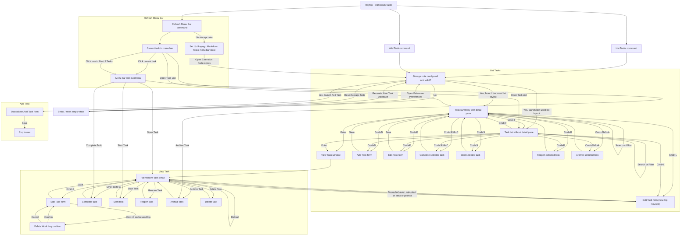

# Development Notes

## Window Flow

This diagram is the implementation-facing source of truth for Raylog - Markdown
Tasks' current window and navigation flow. The automated test suite validates
the Mermaid block below so the documented flow stays aligned with the extension
behavior.

## Architecture

Keep new code aligned with the current split between pure logic and Raycast
integration:

- `src/components` should stay focused on rendering, Raycast component wiring,
  and user-triggered command setup.
- `src/lib` should hold shared task logic, storage and persistence behavior,
  sorting and filtering, validation, and other helpers that can be exercised in
  tests without rendering UI.
- Prefer pure modules in `src/lib` when behavior can be expressed without
  `@raycast/api`; this keeps task rules and storage behavior easy to test.
- Treat flow/spec modules as the source of behavior decisions and shortcuts.
  For example, `src/lib/task-flow.ts` builds task action specs, while
  `src/components/task-action-specs.tsx` adapts those specs into Raycast
  `Action` components.
- When adding features, prefer extending existing pure helpers first and keeping
  Raycast-only adapters thin. Match the current codebase rather than
  introducing a new framework or layer.
